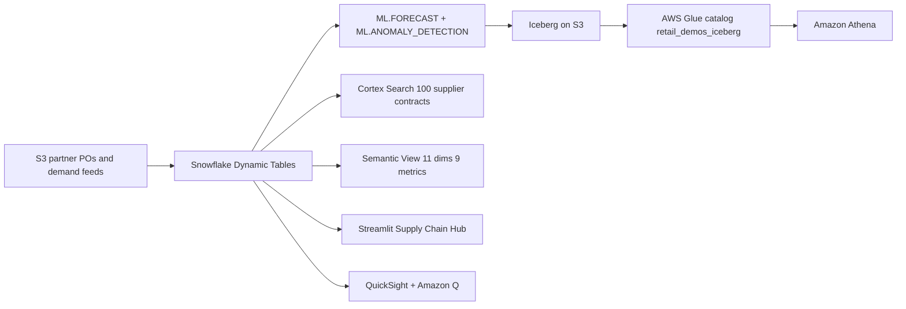

# Supply Chain Intelligence — Reference Architecture Demo
### Snowflake AI Data Cloud | Retail/CPG

> An end-to-end supply chain analytics platform across 10 APJ warehouses and 50 suppliers — Dynamic Tables, Cortex AI, ML Forecast, Cortex Search, and Semantic Views in a 5-tab Streamlit app.

## Architecture

A retail supply chain intelligence hub built on **Snowflake** (Dynamic Tables, ML.FORECAST, ML.ANOMALY_DETECTION, Cortex Search, semantic view, Cortex Analyst) and **AWS** (S3, Apache Iceberg, AWS Glue, Athena, QuickSight + Amazon Q). Partner POs and demand feeds land in S3; Snowflake builds the curated layer; the forecast lands back in the lake as Iceberg.




## What It Does

| Capability | Technology | Detail |
|---|---|---|
| Transform | Dynamic Tables (5 min lag) | INVENTORY_HEALTH, SUPPLIER_PERFORMANCE, DEMAND_TRENDS |
| AI Enrichment | Cortex AI_SENTIMENT, AI_CLASSIFY | Contract risk sentiment, PO delay classification |
| Search (RAG) | Cortex Search | Semantic search over 100 supplier contracts |
| ML Forecast | Snowflake ML FORECAST | 14-period demand prediction per product |
| Anomaly Detection | Snowflake ML ANOMALY_DETECTION | Inventory level anomalies |
| NL Queries | Semantic View + Cortex Agent | "Which warehouses have the lowest fill rate?" |
| Analyst UI | Streamlit in Snowflake | 5-tab Supply Chain Hub |

### Optional AWS Extension

| Capability | Technology | Detail |
|---|---|---|
| Data Ingestion | Amazon S3 + External Stage | Partner PO files from S3 |
| Data Lake Export | Iceberg → AWS Glue | Forecast results as Parquet on S3, registered in Glue |
| Exec BI | Amazon QuickSight + Amazon Q | Inventory & supplier dashboards + NLP queries |

See [`aws/README.md`](aws/README.md) for full AWS setup (S3, IAM, Glue, Lake Formation, Athena, QuickSight).

## Repo Structure

```
retail-supply-chain/
├── snowflake/
│   ├── 00_setup.sql              # DB, schemas, warehouse
│   ├── 01_integrations.sql       # S3 external stage (optional, for AWS)
│   ├── 02_raw_tables.sql         # 7 tables + synthetic data
│   ├── 03_curated.sql            # 3 Dynamic Tables + Cortex AI
│   ├── 04_search.sql             # Cortex Search (supplier contracts)
│   ├── 05_ml.sql                 # FORECAST + ANOMALY_DETECTION
│   ├── 06_iceberg.sql            # Iceberg → Glue (optional, for AWS)
│   └── 07_semantic.sql           # Semantic View
├── streamlit/
│   ├── streamlit_app.py          # 5-tab Supply Chain Hub
│   └── deploy/                   # Snowflake deploy version
├── aws/
│   └── README.md                 # Full AWS setup guide + troubleshooting
├── quicksight/
│   └── deploy.sh                 # QuickSight datasets + Q topic (optional)
├── demo/
│   └── demo_script.md            # Demo narration script
└── README.md
```

## Data

| Table | Rows | Content |
|---|---|---|
| SUPPLIERS | 50 | APJ suppliers across 12 countries |
| PRODUCTS | 500 | Food & beverage product catalog |
| WAREHOUSES | 10 | Distribution centers (SG, SYD, TKY, BKK, MUM, SH, JKT, SEL, AKL, KL) |
| INVENTORY_SNAPSHOTS | 50,000 | Daily stock levels per product/warehouse |
| PURCHASE_ORDERS | 10,000 | PO tracking with delivery dates and delay reasons |
| DEMAND_SIGNALS | 100,000 | Point-of-sale demand by product/warehouse/channel |
| SUPPLIER_CONTRACTS | 100 | Contract documents for Cortex Search |

## Quick Start

### Prerequisites
- Snowflake account with ACCOUNTADMIN
- `snow` CLI configured

### Build (Snowflake only)
Run SQL files in order (00, 02-05, 07 — skip 01 and 06 if no AWS), then deploy Streamlit:
```bash
cd streamlit/deploy && snow streamlit deploy --replace --connection <CONNECTION>
```

### Build (with AWS)
Run all SQL files (00-07), complete AWS setup in [`aws/README.md`](aws/README.md), then deploy:
```bash
cd streamlit/deploy && snow streamlit deploy --replace --connection <CONNECTION>
bash quicksight/deploy.sh  # optional
```

### Health Check
```sql
SELECT
    (SELECT COUNT(*) FROM RETAIL_SUPPLY_CHAIN.RAW.SUPPLIERS) AS suppliers,
    (SELECT COUNT(*) FROM RETAIL_SUPPLY_CHAIN.RAW.PRODUCTS) AS products,
    (SELECT COUNT(*) FROM RETAIL_SUPPLY_CHAIN.CURATED.INVENTORY_HEALTH) AS inventory,
    (SELECT COUNT(*) FROM RETAIL_SUPPLY_CHAIN.ML.DEMAND_FORECAST_RESULTS) AS forecasts;
```

## Streamlit App (5 Tabs)

| Tab | Feature | Key Capability |
|---|---|---|
| Inventory Health | Stock heatmap, stockout alerts, value by warehouse | Dynamic Tables |
| Supplier Scorecard | On-time %, grades A-D, spend analysis | Dynamic Tables |
| Demand Forecast | 14-period predictions, anomaly detection | Snowflake ML |
| Contract Search | Semantic search + AI summary over 100 contracts | Cortex Search |
| Ask Supply Chain | Natural language queries | Semantic View + Agent |

## Legal

Licensed under the Apache License, Version 2.0.

This is a personal project and is **not an official Snowflake offering**. It comes with no support or warranty. Do not use in production without thorough review and testing.
