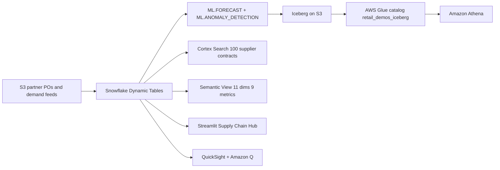

# Supply Chain Intelligence

End-to-end supply chain analytics platform across 10 APJ warehouses and 50 suppliers — Dynamic Tables, Cortex AI, ML Forecast, Cortex Search, and Semantic Views in a 5-tab Streamlit app.

## Architecture

A retail supply chain intelligence hub built on **Snowflake** (Dynamic Tables, ML.FORECAST, ML.ANOMALY_DETECTION, Cortex Search, semantic view, Cortex Analyst) and **AWS** (S3, Apache Iceberg, AWS Glue, Athena, QuickSight + Amazon Q). Partner POs and demand feeds land in S3; Snowflake builds the curated layer; the forecast lands back in the lake as Iceberg.



## Snowflake Capabilities

| Capability | Implementation |
|-----------|---------------|
| Dynamic Tables | INVENTORY_HEALTH / SUPPLIER_PERFORMANCE / DEMAND_TRENDS |
| ML Functions | ML.FORECAST (14-period demand) + ML.ANOMALY_DETECTION (inventory) |
| Cortex Search | 100 supplier contracts indexed |
| Cortex Agent | SupplyChainAnalyst + ContractSearch tools |
| Semantic View | 11 dimensions, 9 metrics over 3 curated tables |
| Streamlit | 5-tab Supply Chain Hub |
| Iceberg Tables | Forecast export to S3 for cross-platform access |

## AWS Services

| Service | Role in Demo |
|---------|-------------|
| Amazon S3 | Partner POs and demand feed landing zone |
| Apache Iceberg | Open table format for forecast export |
| AWS Glue | Iceberg catalog (retail_demos_iceberg) |
| Amazon Athena | Federated query over forecast Iceberg tables |
| Amazon QuickSight | Executive supply chain dashboard |
| Amazon Q | Natural language analytics for VP Supply Chain |

## Personas

| Persona | Role | Key Questions |
|---------|------|---------------|
| **Supply Chain Analyst** | Inventory and supplier management | "Which warehouses have the lowest fill rate?" "Which suppliers are consistently late?" |
| **VP Supply Chain** | Strategic supply chain decisions | "What's our overall service level?" "Where should we dual-source?" |

## Data

| Table | Rows | Description |
|-------|------|-------------|
| SUPPLIERS | 50 | APJ suppliers across 12 countries |
| PRODUCTS | 500 | Food & beverage product catalog |
| WAREHOUSES | 10 | Distribution centers (SG, SYD, TKY, BKK, MUM, SH, JKT, SEL, AKL, KL) |
| INVENTORY_SNAPSHOTS | 50,000 | Daily stock levels per product/warehouse |
| PURCHASE_ORDERS | 10,000 | PO tracking with delivery dates and delay reasons |
| DEMAND_SIGNALS | 100,000 | Point-of-sale demand by product/warehouse/channel |
| SUPPLIER_CONTRACTS | 100 | Contract documents for Cortex Search |

## Build Instructions

### Prerequisites
- Snowflake account with ACCOUNTADMIN access
- Cortex AI enabled (ML Functions, Search, Agent)
- Warehouse: CORTEX (Medium)

### Deployment

```bash
snowsql -f snowflake/00_setup.sql
snowsql -f snowflake/01_integrations.sql
snowsql -f snowflake/02_raw_tables.sql
snowsql -f snowflake/03_curated.sql
snowsql -f snowflake/04_search.sql
snowsql -f snowflake/05_ml.sql
snowsql -f snowflake/06_iceberg.sql
snowsql -f snowflake/07_semantic.sql
```

### Streamlit App
```
RETAIL_SUPPLY_CHAIN.APP.SUPPLY_CHAIN_HUB
```

## Build Modes

### Snowflake Only
Run the SQL scripts in `snowflake/` (skip `01_integrations.sql`) and deploy the Streamlit app from `streamlit/deploy/`. Uses Cortex AI instead of Bedrock, and Snowflake Intelligence instead of QuickSight.

### Full AWS + Snowflake
Run all SQL scripts including `01_integrations.sql`, deploy the main Streamlit app from `streamlit/`, then run the QuickSight setup from `quicksight/`.

## Business Impact

Industry research and Snowflake customer outcomes:
- **AI demand forecasting** improves accuracy 20-50% over traditional methods -- McKinsey
- **Global retail stockout losses**: $1.14 trillion per year -- IHL Group
- **Tapestry** (Coach, Kate Spade -- Snowflake customer): supply chain data sharing reduced from 6-8 weeks to half a day -- snowflake.com/customers
- **Inventory carrying cost reduction** of 20-30% with AI-driven optimization -- Industry benchmark

## Key Demo Numbers

- **50 suppliers** scored with on-time %, quality, and cost metrics
- **14-period demand forecast** per product with anomaly detection
- **100 supplier contracts** searchable via Cortex Search
- **Iceberg export** — forecast results accessible from Athena and QuickSight

## License

Apache 2.0 — See [LICENSE](LICENSE) for details.

This is a personal demo project and is not an official Snowflake offering. It comes with no support or warranty. Industry metrics cited are from publicly available third-party research and Snowflake customer stories; they represent reported outcomes and are not guarantees of results.
